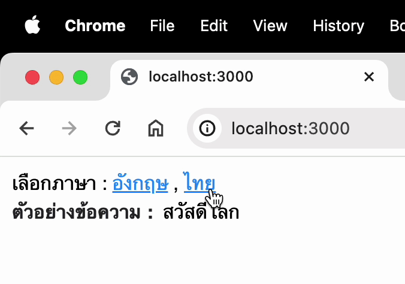

# Change language | NextJS
> **Example :**
> 
>

# Map config
> 1. [conf_lang.ts](app%2Flang%2Fconf_lang.ts) set variable language.
> 2. [en.ts](app%2Flang%2Fen.ts) , [th.ts](app%2Flang%2Fth.ts) add key and value of language.
> 3. [middleware.ts](middleware.ts) set cookie and redirect
> 4. [page.tsx](app%2Fpage.tsx) Example use.
